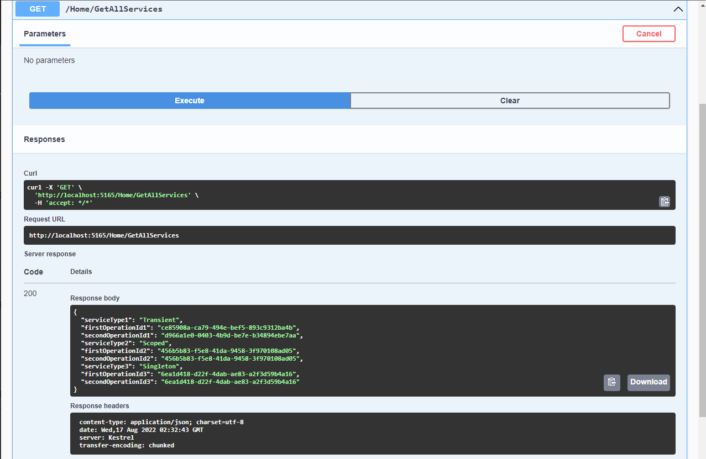
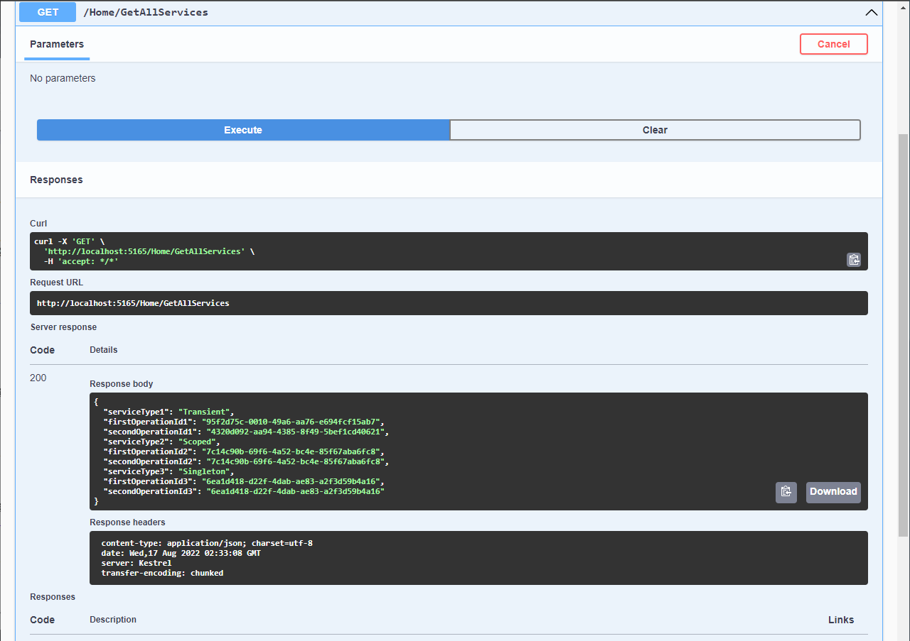

## What is this project

- In this example, I added three interfaces called:
  - ItransientService
  - IScopedService
  - ISingletonService
- Which represents one of each of the DI lifetimes.
- Those interfaces contain a single method called GetOperationID(); which will return a uniqueGuid.
- The lifetime of the service depends on when the dependency is instantiated and how long it lives. And lifetime depends on how we have registered those services.
- The below three methods define the lifetime of the services:
  - AddTransient
    - Transient lifetime services are created each time they are requested. This lifetime works best for lightweight, stateless services.
  - AddScoped
    - Scoped lifetime services are created once per request.
  - AddSingleton
    - Singleton lifetime services are created the first time they are requested (or when ConfigureServices is run if you specify an instance there) and then every subsequent request will use the same instance.

## Project type `web api`

.NET 6

## Result of this project

- First request
  

- Second request
  
